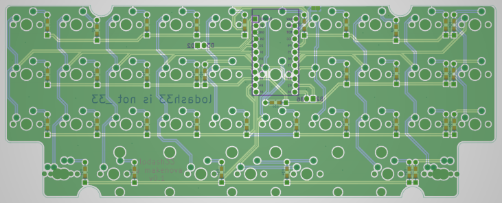

# lodash33

A promicro version of the _33 keyboard.  There are produciton files in the "gerbers" directory for the pcb and a skeleton case.
Simply upload the zip files to your PCB manufacturer of choice.

You'll also need

* Diodes (1N4148W)
  * Through hole or SMD(sod-123). Either will work
* Pro Micro(PM) or compatible board
  * I prefer something with USB C
  * You can use a nice!nano if you want to make it wireless
* Hardware
  * M2 screws
  * M2 standoffs(10mm will work if solder your PM directly or socket with low profile sockets use 12mm to be safe)

There are at least two possible layouts

Starting firmware can be found on my QMK fork in the [`makenova`](https://github.com/makenova/qmk_firmware/tree/makenova/keyboards/makenova/lodash33) branch.

Here is what a built version can look like:  

